# PR1_AdminBBDD_Leandro_Kyliam

# 1. Creación de la base de datos
Crea la base de datos vacía. Se hace como postgres (superusuario). Se comprueba con \l.
```postgresql
CREATE DATABASE biblioteca;
CREATE DATABASE
```

# 2. Creación de usuarios

> [!NOTE]
> En PostgreSQL todo son roles: un usuario es un rol con LOGIN y un grupo es un rol sin él. Los permisos van por niveles independientes: base de datos (CONNECT) → esquema (USAGE) → tablas (SELECT, INSERT...). Para leer una tabla hace falta permiso en los tres.

## 2.a.i

```postgresql
biblioteca=# CREATE ROLE admin_biblio WITH LOGIN PASSWORD 'adminpass';
CREATE ROLE
biblioteca=# GRANT ALL PRIVILEGES ON DATABASE biblioteca TO admin_biblio;
GRANT
biblioteca=# ALTER DATABASE biblioteca OWNER TO admin_biblio;
ALTER DATABASE
```

## 2.a.ii

```postgresql
biblioteca=# CREATE ROLE usuario_biblio WITH LOGIN PASSWORD 'usuariopass';
CREATE ROLE
postgres=# GRANT CONNECT ON DATABASE biblioteca TO usuario_biblio;
GRANT
```

## 2.b 

lectores es NOLOGIN porque es un grupo, no una persona. Necesita USAGE en el esquema y SELECT en las tablas.

> [!WARNING]
> ON ALL TABLES solo afecta a las tablas que ya existen. Funciona porque se ejecutó después de crear las tablas del apartado 3. Para tablas futuras existe ALTER DEFAULT PRIVILEGES.

```postgresql
biblioteca=# CREATE ROLE lectores NOLOGIN;
CREATE ROLE
biblioteca=# GRANT USAGE ON SCHEMA public TO lectores;
GRANT
biblioteca=# GRANT SELECT ON ALL TABLES IN SCHEMA public TO lectores;
GRANT
```

## 2.c 

```postgresql
biblioteca=# GRANT lectores TO usuario_biblio;
GRANT ROLE
```

## 2.d. 

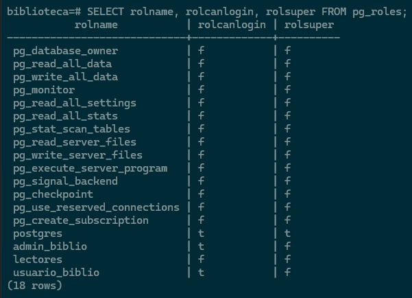

## 2.e. 

```postgresql
biblioteca=# ALTER ROLE usuario_biblio WITH PASSWORD '12345678';
ALTER ROLE
```

## 2.f. 

```postgresql
biblioteca=# REVOKE DELETE ON ALL TABLES IN SCHEMA public FROM usuario_biblio;
REVOKE
```

# 3. Creación de tablas

## Creacion de la tabla autores, libros y prestamos con sus respectivas claves primarias y foráneas

Se crean en orden: autores → libros → prestamos, porque una clave foránea solo puede apuntar a una tabla que ya existe.

* SERIAL: id automático, no se pone al insertar.
* fecha_devolucion admite NULL a propósito: NULL = préstamo pendiente.
* prestamos → libros con ON DELETE CASCADE: al borrar un libro se borran sus préstamos (no tienen sentido sin el libro).
* libros → autores sin nada: no deja borrar un autor con libros (no queremos borrar libros en cadena).


```postgresql
biblioteca=# CREATE TABLE autores(id_autor SERIAL PRIMARY KEY, nombre TEXT NOT NULL, nacionalidad TEXT);
CREATE TABLE
```
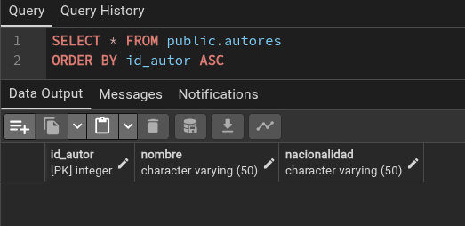

```postgresql
biblioteca=# CREATE TABLE libros(id_libro SERIAL PRIMARY KEY, titulo TEXT NOT NULL, año_publicacion REAL, id_autor INTEGER NOT NULL REFERENCES autores(id_autor));
CREATE TABLE
```
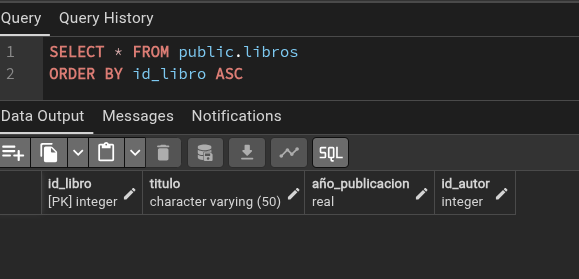

```postgresql
biblioteca=# CREATE TABLE prestamos(id_prestamo SERIAL PRIMARY KEY, id_libro INTEGER NOT NULL REFERENCES libros(id_libro), fecha_prestamo DATE NOT NULL, fecha_devolucion DATE, usuario_prestatario TEXT NOT NULL);
CREATE TABLE
```
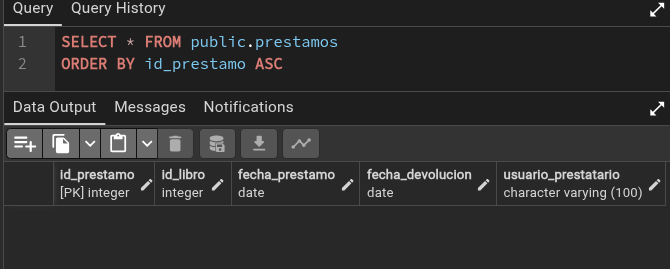

# 4. Inserción de datos

Primero autores, luego libros, luego préstamos (por las claves foráneas). INSERT 0 5 = 5 filas insertadas; el 0 es un resto histórico, siempre sale. Si un INSERT falla, la secuencia no retrocede y quedan huecos en los ids, que es normal.

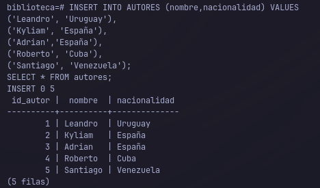
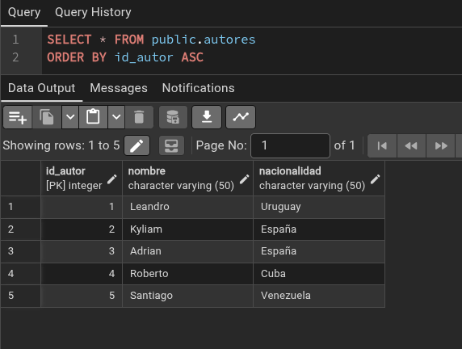
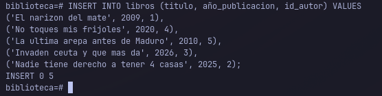
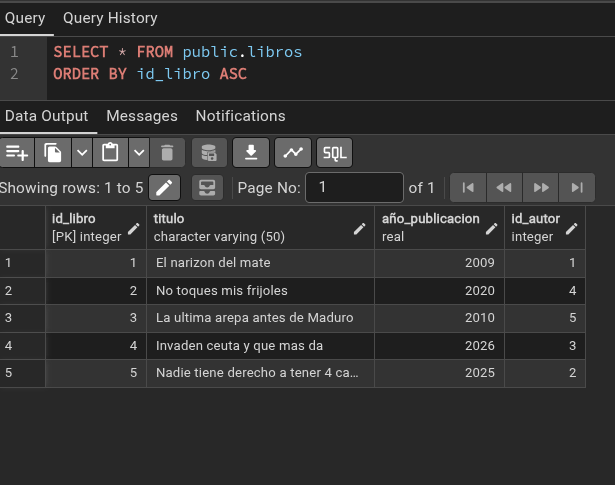
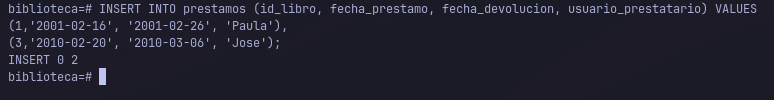
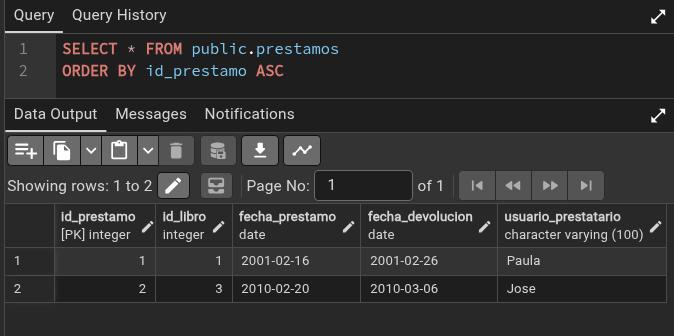

# 5. Consultas básicas
JOIN ... ON junta filas de dos tablas donde coincide la condición (clave foránea = clave primaria). l y a son alias.

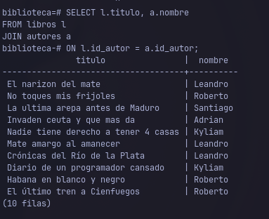

Con NULL siempre IS NULL, nunca = NULL (no devuelve nada).

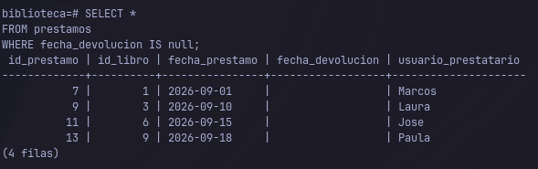

libros unida consigo misma para emparejar libros del mismo autor. DISTINCT porque un autor con 3 libros saldría 6 veces. Se compara por id_libro porque los títulos podrían repetirse.
Otra opción que descubrimos pero no fue nuestra intuición sería:

```postgresql
SELECT a.nombre, COUNT(*) FROM autores a
JOIN libros l ON l.id_autor = a.id_autor
GROUP BY a.nombre HAVING COUNT(*) > 1;
```

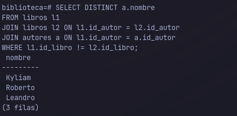
# 6. Consultas con agregación
> [!NOTE]
> COUNT, SUM, AVG, MIN, MAX resumen muchas filas en un valor. Sin GROUP BY → una fila para toda la tabla. Con GROUP BY → una fila por grupo. WHERE filtra filas antes de agrupar; HAVING filtra grupos después (condiciones con COUNT van en HAVING). Toda columna del SELECT sin función de agregación tiene que estar en el GROUP BY.

COUNT(*) cuenta todas las filas. COUNT(columna) no cuenta los NULL.

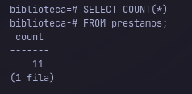

Agrupa por usuario y cuenta sus filas. Cuenta préstamos; para libros distintos sería COUNT(DISTINCT id_libro).

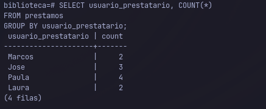

# 7. Modificación de datos

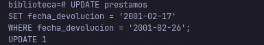

Hecho dentro de BEGIN ... ROLLBACK para poder deshacerlo (el * del prompt indica transacción abierta). Se ve el CASCADE: tras borrar el libro, sus préstamos desaparecen. DELETE 1 solo cuenta el libro, no los préstamos borrados en cascada; por eso hay que volver a consultar.

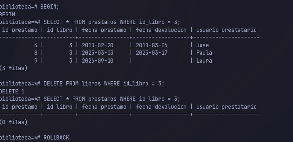

# 8. Creación de vistas

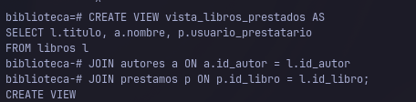
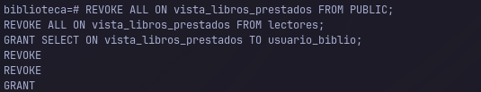

Se quita a PUBLIC y a lectores (las vistas cuentan como tablas para los permisos) y se da solo a usuario_biblio. SET ROLE sirve para probar como otro usuario; RESET ROLE para volver. admin_biblio no puede verla porque la vista es de postgres y no tiene permiso. Prompt => = usuario normal, =# = superusuario.

La vista accede a las tablas con los permisos de su dueño, así que se puede consultar sin tener permisos en las tablas.

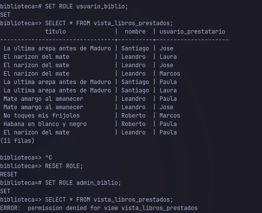

# 9. Funciones y consultas avanzadas
> [!NOTE]
> RETURNS es obligatorio (qué devuelve). RETURNS TABLE(...) → se llama con SELECT * FROM funcion('valor'); si devuelve un valor, SELECT funcion('valor'). Los textos van con comillas simples. El cuerpo va entre $$ ... $$. Se listan con \df.

> [!WARNING]
> si el parámetro se llama igual que una columna (nombre), gana la columna, la condición queda a.nombre = a.nombre y devuelve todos los libros. Por eso el parámetro es nombre_autor. CREATE OR REPLACE no deja renombrar parámetros: hay que hacer antes DROP FUNCTION libros_de_autor(text);.

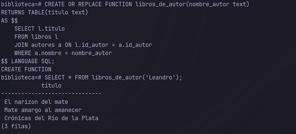
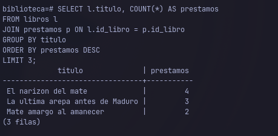

# 10. Exportación e importación de datos

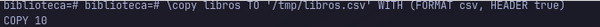
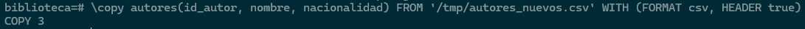

### Práctica hecha por Leandro Delli Santi y Kyliam Chinea Salcedo, alu0101584003 y alu0101548050 respectivamente
